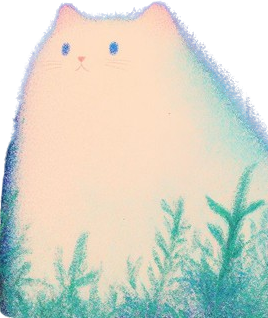

  <h3>
    
  </h3>

  
  
  
  

-----------------------------------------------------------------------------------------------------------------------------

---
 

<table>
  <tr>
    <td align="center" width="50%">
      <h2>🐳 My Skills</h2>
      
      
      
       
      
      
      
       
      
      
      
      
      
    </td>
    <td align="center" width="50%">
      
    </td>
  </tr>
</table>

 

  

  ### ✨ PROJECT
  
  
Project

| Project | description | Duration | skill |
|----------|------|------|------|
| [MotionMate](https://github.com/motion-mate/FE-motion-mate) | "운동,커뮤니티,쇼핑몰기능 결합한 SNS기반 소셜커머스플랫폼" | 2025.05 ~ 2025.06 |      |
| [Banana](https://github.com/KH-mini-project/banana) | "Velog클론프로젝트 게시글작성,댓글,좋아요 기능중심 기술블로그" | 2025.04 ~ 2025.04 |      |
| [KickMovie](https://github.com/KH-Movie-Web-Project/FE-kick-movie) | “TMDBAPI기반 영화정보, 평점확인 서비스” | 2025.03 ~ 2025.05 |      |

---
 

  <h3>🎓 Education</h3>
- 구현고등학교 — 졸업 (2019.02) 
- 신안산대학교 컴퓨터정보학과 — 졸업 (2025.06)

  
 
  

